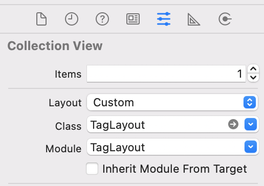

# TagLayout

[](https://cocoapods.org/pods/TagLayout) [](https://cocoapods.org/pods/TagLayout) [](https://cocoapods.org/pods/TagLayout)


## Example

To run the example project, clone the repo, and run `pod install` from the Example directory first.


## Minimum Requirements
- iOS 9.0 
- Swift 5
- Xcode 11

## Installation

TagLayout is available through [CocoaPods](https://cocoapods.org). To install it, simply add the following line to your Podfile:

```ruby
pod 'TagLayout'
```

## Usage

    import TagLayout

**1. Using Code**

    @IBOutlet weak var collectionView: UICollectionView!
    var tagLayout = TagLayout()
    
    override func viewDidLoad() {
        super.viewDidLoad()
        
        tagLayout.delegate = self
        tagLayout.scrollDirection = .horizontal
        tagLayout.cellSpacing = 5.0
        collectionView.setCollectionViewLayout(tagLayout, animated: true)
    }

**2. Using Storyboard**

Set the Layout of CollectionView as *Custom* and enter *TagLayout* as the layout.
Make sure the target is also set as *TagLayout*.

Refer screenshot below:




In your ViewController:

    if let tagLayout = collectionView.collectionViewLayout as? TagLayout {
        tagLayout.delegate = self
        tagLayout.scrollDirection = .horizontal
        tagLayout.cellSpacing = 5.0
     }

### Delegate

    extension ViewController: TagLayoutDelegate {
        
        //Return width of the cell here. 
        func widthForItem(at indexPath: IndexPath) -> CGFloat {
            return 100.0
        }
        
        //Return height of the cell or row here. Will remain same for all the cells
        func rowHeight() -> CGFloat {
            return 40.0
        }
    }


### Properties

 - cellSpacing - Spacing between cells. Default is 10.0

       tagLayout.cellSpacing = 20.0
       
- scrollDirection - Can be horizontal or vertical. Default is Vertical.
             
      tagLayout.scrollDirection = .horizontal


### Methods
- reset() - Used to reset the layout. Invalidates the current layout and recreates the layout from scratch. 
To be used when changing scroll direction on runtime or when there is change in size of cells.

> Try performing reset() on layout when cell UI appears malformed after performing operation on CollectionView.
       
      tagLayout.reset()

## Contributions
I'd love to see you contributing to this project by proposing or adding features, reporting bugs, or spreading the word. Any help or contribution is appreciated. 


## Author

udbhateja (udaybhateja@ymail.com)
bit.ly/udbhateja

## License

**TagLayout** is available under the MIT license. See the **LICENSE** file for more info.


